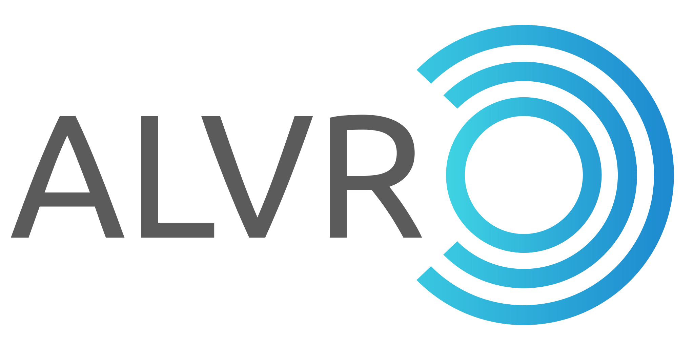

<p align="center">  </p>

# Mint Linux ALVR Build — one-click start

This branch is a **Linux Mint–oriented** fork of [ALVR](https://github.com/alvr-org/ALVR) aimed at a **stable, one-click** streamer launch (dashboard + SteamVR + capture path) for wireless PCVR—especially with the **Apple Vision Pro App Store client**—without the usual “restart SteamVR on every connect” loop or SteamVR crashes many are facing.

Upstream ALVR documentation and compatibility tables continue below. This preamble only describes **what this fork adds and why**.

## Why Linux needs more than Windows

On **Windows**, ALVR can use **OpenVR DirectMode**: the game submits eye textures **into the ALVR driver**, which composites and encodes. SteamVR’s desktop compositor is largely outside the encode path.

On **Linux**, ALVR has **no DirectMode path** in this codebase. The driver still exposes a normal HMD to SteamVR (`IsDisplayRealDisplay` is true on Linux), so:

1. Games submit through **SteamVR’s real `vrcompositor`**.
2. ALVR must **capture** the composed stereo image after the fact.

That capture stack is **required for streaming**, not optional:

| Component | Role |
|-----------|------|
| **`vrcompositor-wrapper`** | Symlinked over SteamVR’s `vrcompositor`; injects the capture Vulkan layer, session path, and GPU env; keeps process name `vrcompositor` (truncated names break readiness / error 303). |
| **`VK_LAYER_ALVR_capture`** | Headless swapchain intercept: image FDs + pose to the encoder. |
| **Linux `CEncoder`** | Encodes frames and stamps tracking timestamps for client late-stage warp (LSW). |

**One-click start** (local helper "./scripts/restart-alvr-steamvr.sh") wraps: stop old processes → solidify hard OpenVR config → register driver → wrap compositor → start dashboard with an **absolute** path → launch SteamVR. Without the wrap step, the layer is not loaded and there is nothing to encode.

## Network / config architecture (stable one-click)

Stock ALVR often **rebuilds `openvr_config` on headset connect** and can **restart SteamVR** when resolution/codec/FPS disagree with what the driver already published. That is hostile to “click once and connect.”

This fork changes that lifecycle:

1. **Hard config solidify** — Before SteamVR starts, bake OpenVR + encoder fields into `session.openvr_config` (valid NvEnc presets, eye resolution, refresh rate, device identity). Mark `hard_config_solidified`.
2. **No connect-time restart** — On client connect, if solidified, a config mismatch is **logged and ignored**; the session does **not** send Restarting / restart the driver mid-flight.
3. **AVP-friendly defaults** — e.g. **TCP** stream protocol (recommended for Vision Pro), controller/hand profile choices from Hard Config UI, so the first connect does not thrash identity.
4. **Absolute dashboard path** — Driver factory path checks accept the streamer only when the dashboard is launched via a real path (relative launches have failed load checks).
5. **Linux readiness** — Idle HMD pose + display timing / vsync path so SteamVR can complete StartVRCompositor without shared-IPC **303** loops; streaming keeps vsync events while client tracking owns poses.

End state: solidify once → one-click launch → connect headset → stream, without SteamVR rebooting on every link.

## Known limits and issues (this fork)

### NVIDIA encoder resolution (Linux / current drivers)

With current **NVIDIA** drivers on Mint, **per-eye encode size above about 3500×3500** has been observed to **crash the NVENC path at stream start**. Stay at **≤ 3500×3500 per eye** (ALVR “eye” / stream resolution, not necessarily desktop resolution). Higher per-eye targets that work on other stacks may not work here until the encoder/driver combination is re-validated.

### Audio

**Sound routing is not automatic and is largely untested** on this Mint setup. Expect manual Pulse/PipeWire device selection and SteamVR/ALVR audio settings. Silence after a good video stream is a known open area, not proof that video is misconfigured.

### Occasional non-game stutters

Capture and encode share the GPU with SteamVR’s compositor. Process scheduling helpers may raise CPU nice of `vrcompositor` / `vrserver` after launch; that is best-effort (deeper realtime priority usually needs extra capabilities). Stutters can still come from GPU contention, power management, or encode load—not only game CPU.

### Late-stage warp / stereo (Linux-specific work in this branch)

Linux LSW depends on correct **frame pose timestamps** (compositor pose scan + history association) and correct **ViewsConfig** (reject invalid FOV; client IPD). Windows DirectMode does not use the same capture path; regressions here are usually Linux-only.

## Build on Linux Mint (dependencies + streamer)

Target: **Linux Mint 22 / Ubuntu 24.04-class** systems (Debian-based `apt`). Other distros: see upstream [Building From Source](https://github.com/alvr-org/ALVR/wiki/Building-From-Source).

### 1. System packages (required before first build)

```bash
./scripts/build-streamer-linux.sh --deps
```

That installs (sudo) roughly:

| Category | Packages |
|----------|----------|
| Toolchain | `build-essential` `pkg-config` `git` `curl` `unzip` `cmake` `clang` `libclang-dev` `nasm` `yasm` |
| Crypto / UI | `libssl-dev` `libgtk-3-dev` `libspeechd-dev` `libxkbcommon-dev` |
| Audio | `libasound2-dev` `libjack-dev` `libpipewire-0.3-dev` `libspa-0.2-dev` `pulseaudio-utils` |
| Video / GPU | `libvulkan-dev` `libdrm-dev` `libva-dev` `libx264-dev` `libx265-dev` `libxrandr-dev` |
| XCB | `libxcb-render0-dev` `libxcb-shape0-dev` `libxcb-xfixes0-dev` |
| Unwind (Vulkan layer stack scan) | `libunwind-dev` |

**Also required outside that script:**

- **Rust** via [rustup](https://rustup.rs/) (the build script installs it if `cargo` is missing). Use a recent stable toolchain (workspace `rust-version` may require **1.92+**).
- **Steam** + **SteamVR** (beta is what this fork was validated against).
- **GPU drivers:** NVIDIA proprietary driver with working Vulkan + **NVENC** for the usual path; or AMD/Intel with VA-API / AMF as supported by upstream ALVR.
- **NVIDIA / NVENC builds:** a working **CUDA toolkit / `nvcc`** is expected when you do *not* pass `--no-nvidia` to `prepare-deps` (the script’s default). AMD-only: use `--no-nvidia`.
- **Git submodules** (OpenVR headers): the build script runs `git submodule update --init --recursive`.

### 2. Build the streamer

```bash
# First full build (downloads/builds FFmpeg etc. — can take a long time)
./scripts/build-streamer-linux.sh

# AMD/Intel only (skip NVIDIA/CUDA prepare path)
./scripts/build-streamer-linux.sh --no-nvidia

# Rebuild only (after sources change; skips prepare-deps)
./scripts/build-streamer-linux.sh --skip-deps-prep

# Debug build (faster compile)
./scripts/build-streamer-linux.sh --debug --skip-deps-prep
```

Output layout:

```text
build/alvr_streamer_linux/
  bin/alvr_dashboard
  lib64/alvr/…          # OpenVR driver
  libexec/alvr/…        # vrcompositor-wrapper, etc.
  lib64/libalvr_vulkan_layer.so
```

Equivalent manual steps (same as the script):

```bash
cargo xtask prepare-deps --platform linux          # add --no-nvidia if needed
cargo xtask build-streamer --platform linux --release
```

### 3. One-click start

```bash
./scripts/restart-alvr-steamvr.sh
```

What it does: stop old processes → mark session solidified / soft session defaults → register external driver in OpenVR paths → wrap SteamVR `vrcompositor` with ALVR’s wrapper + named binary → start `alvr_dashboard` with an **absolute** path → launch SteamVR → best-effort `renice` on capture processes.

```bash
./scripts/restart-alvr-steamvr.sh --no-steam   # wrap + dashboard only
```

Optional env: `STEAM_ROOT`, `ALVR_STREAM_NICE` (default `-5`), `STEAMVR_SETTINGS`.

Typical first-time flow: **build** → open dashboard once → **Hard Config → Apply AVP defaults → Solidify** (or rely on the script’s session touch after you have a session.json) → **`./scripts/restart-alvr-steamvr.sh`** → wait for SteamVR Ready → open the headset client.

---

# ALVR - Air Light VR

[![badge-discord][]][link-discord] [![badge-matrix][]][link-matrix] [![badge-opencollective][]][link-opencollective]

Stream VR games from your PC to your headset via Wi-Fi.
This is a fork of [ALVR](https://github.com/polygraphene/ALVR).

### Direct download to the latest version:
### [Windows Launcher](https://github.com/alvr-org/ALVR/releases/latest/download/alvr_launcher_windows.zip) | [Linux Launcher](https://github.com/alvr-org/ALVR/releases/latest/download/alvr_launcher_linux.tar.gz)

## Compatibility

|          VR Headset          |                                        Support                                         |
| :--------------------------: | :------------------------------------------------------------------------------------: |
|       Apple Vision Pro       |    :heavy_check_mark: ([store link](https://apps.apple.com/app/alvr/id6479728026))     |
|      Quest 1/2/3/3S/Pro      | :heavy_check_mark: ([store link](https://www.meta.com/experiences/7674846229245715) *) |
|     Pico Neo 3/4/4 Ultra     |                                   :heavy_check_mark:                                   |
|    Play For Dream YVR 1/2/MR |                                   :heavy_check_mark:                                   |
| Vive Focus 3/Vision/XR Elite |                                   :heavy_check_mark:                                   |
|           Lynx R1            |                                   :heavy_check_mark:                                   |
|     PhoneVR (smartphone)     |     :heavy_check_mark: ** ([repo](https://github.com/PhoneVR-Developers/PhoneVR))      |
|        Android/Monado        |                                      :warning: **                                      |
|          Oculus Go           |                 :x: ([old repo](https://github.com/polygraphene/ALVR))                 |

\* : ALVR for Quest 1 not available through the Meta store.  
\** : Only works on some smartphones, not enough testing.  

|     PC OS      |                                    Support                                    |
| :------------: | :---------------------------------------------------------------------------: |
| Windows 10/11  | :heavy_check_mark: ([store link](https://store.steampowered.com/app/3312710)) |
| Windows XP/7/8 |                                      :x:                                      |
|     Linux      |                             :heavy_check_mark:***                             |
|     macOS      |                                      :x:                                      |

\*** : Linux support is still in beta. To be able to make audio work or run ALVR at all you may need advanced knowledge of your distro for debugging or building from source.

### Requirements

-   A supported standalone VR headset (see compatibility table above)

-   SteamVR

-   High-end gaming PC
    -   See OS compatibility table above.
    -   NVIDIA GPU that supports NVENC (1000 GTX Series or higher) (or with an AMD GPU that supports AMF VCE) with the latest driver.
    -   Laptops with an onboard (Intel HD, AMD iGPU) and an additional dedicated GPU (NVidia GTX/RTX, AMD HD/R5/R7): you should assign the dedicated GPU or "high performance graphics adapter" to the applications ALVR, SteamVR for best performance and compatibility. (NVidia: Nvidia control panel->3d settings->application settings; AMD: similiar way)

-   802.11ac 5Ghz wireless or ethernet wired connection
    -   It is recommended to use 802.11ac 5Ghz for the headset and ethernet for PC
    -   You need to connect both the PC and the headset to same router (or use a routed connection as described [here](https://github.com/alvr-org/ALVR/wiki/ALVR-v14-and-Above))

## Install

Follow the installation guide [here](https://github.com/alvr-org/ALVR/wiki/Installation-guide).

## Troubleshooting

-   Please check the [Troubleshooting](https://github.com/alvr-org/ALVR/wiki/Troubleshooting) page, and also [Linux Troubleshooting](https://github.com/alvr-org/ALVR/wiki/Linux-Troubleshooting) if applicable.
-   Configuration recommendations and information may be found [here](https://github.com/alvr-org/ALVR/wiki/Information-and-Recommendations)

## Uninstall

Open `ALVR Dashboard.exe`, go to `Installation` tab then press `Remove firewall rules`. Close ALVR window and delete the ALVR folder.

## Build from source

You can follow the guide [here](https://github.com/alvr-org/ALVR/wiki/Building-From-Source).

## License

ALVR is licensed under the [MIT License](LICENSE).

## Privacy policy

ALVR apps do not directly collect any kind of data.

## Donate

If you want to support this project you can make a donation to our [Open Source Collective account](https://opencollective.com/alvr).

You can also donate to the original author of ALVR using Paypal (polygraphene@gmail.com) or with bitcoin (1FCbmFVSjsmpnAj6oLx2EhnzQzzhyxTLEv).

[badge-discord]: https://img.shields.io/discord/720612397580025886?style=for-the-badge&logo=discord&color=5865F2 "Join us on Discord"
[link-discord]: https://discord.gg/ALVR
[badge-matrix]: https://img.shields.io/static/v1?label=chat&message=%23alvr&style=for-the-badge&logo=matrix&color=blueviolet "Join us on Matrix"
[link-matrix]: https://matrix.to/#/#alvr:ckie.dev?via=ckie.dev
[badge-opencollective]: https://img.shields.io/opencollective/all/alvr?style=for-the-badge&logo=opencollective&color=79a3e6 "Donate"
[link-opencollective]: https://opencollective.com/alvr
